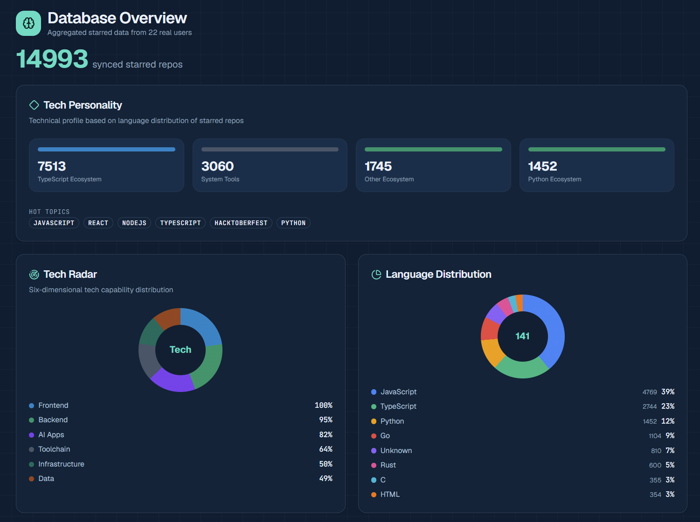
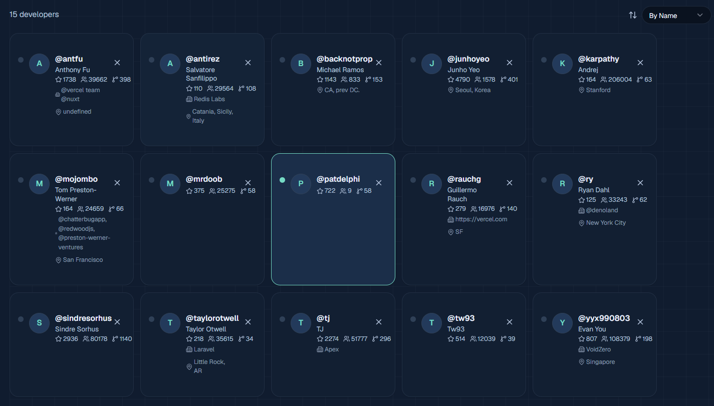
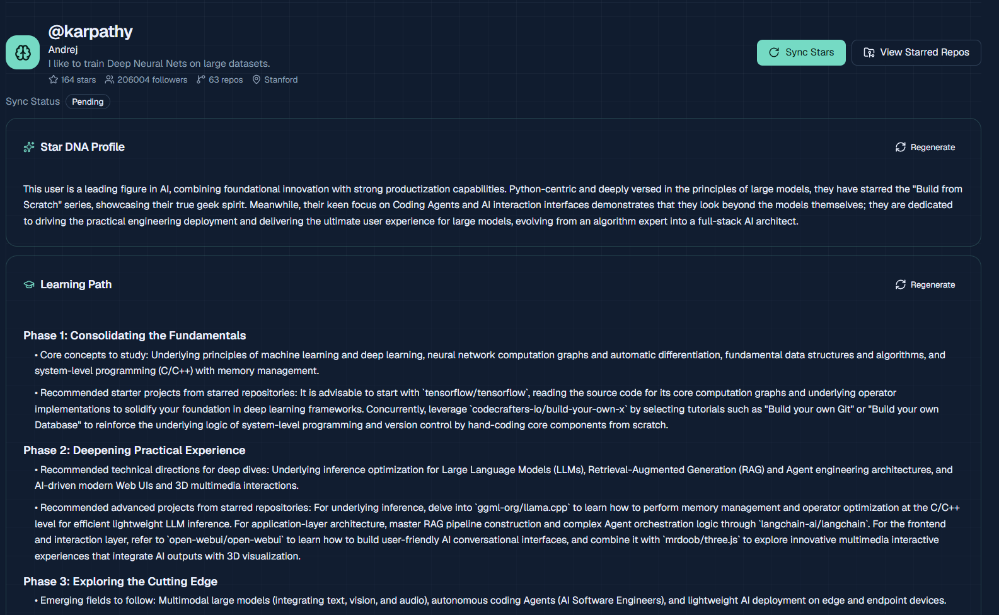
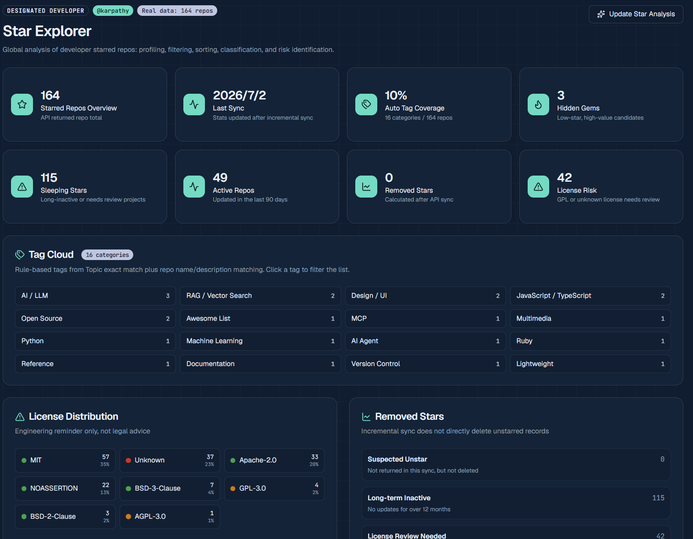
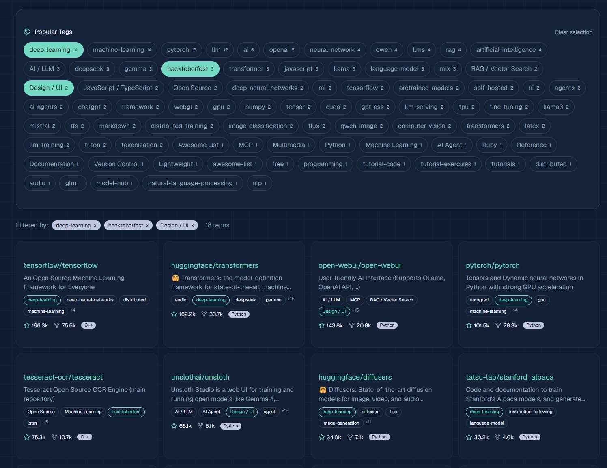
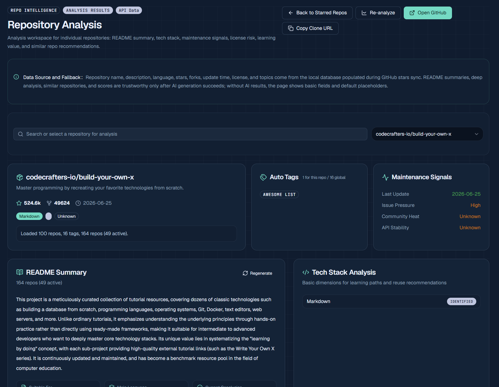
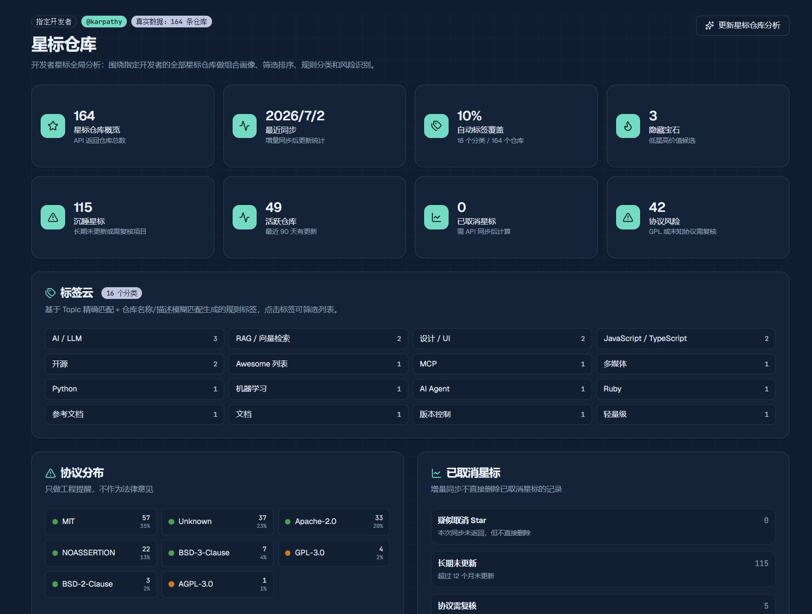
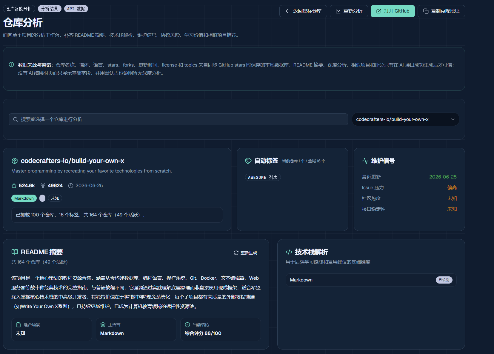

# the-star-way

> [English](./README.md) | 简体中文

> **把 GitHub Stars 变成开发者技术画像、兴趣地图和学习路径。**

[](https://starway.patdelphi.xyz) [](./Docs) [](LICENSE)

输入任意 GitHub 用户名，分析他的 starred repositories：

- **Star DNA** — 开发者技术画像（AI 生成）
- **Learning Path** — 个性化学习路径推荐（AI 生成）
- **Hidden Gems** — 发现被忽略的低星优质项目
- **Tech Map** — 语言、主题、协议、活跃度统计

## 为什么值得用

每个开发者都曾对着自己的 GitHub Stars 列表发呆——上千个仓库堆在一起，谁也说不清自己到底收藏了什么、为什么收藏。更有意思的是，当我们去看那些我们佩服的开发者的星标列表时，往往能发现一条隐藏的学习路径：他们关注什么技术、读过什么书、用什么工具链、最近在折腾什么新东西。

**the-star-way** 把这种"翻看别人收藏夹"的本能变成一个结构化的工具。它不只是另一个 Stars 管理器——它要回答的问题是：

- 我（或某个开发者）的兴趣版图长什么样？
- 那些星标仓库背后，藏着怎样的学习模式和成长轨迹？
- 如果要补齐某个技术方向，下一步该学什么、做什么？

把混乱的星标列表变成一张可检索、可分析、可推导的技术资产地图——这就是 the-star-way 想做的。

## 核心功能

- **星标同步** — 同步任意 GitHub 用户的星标仓库，增量更新，标记已取消星标的仓库
- **智能分类** — 基于 Topic、仓库名、描述的规则自动打标签（AI/LLM、前端框架、DevOps、工具等 60+ 分类）
- **多维筛选** — 按语言、标签、关键词搜索、排序和分页浏览
- **统计分析** — 语言分布、主题聚类、协议分布、活跃/沉睡仓库统计、星标时间轴趋势
- **仓库分析** — 单个仓库的深度信息页，含协议合规分析（MIT/Apache/GPL/CC 等 12 类）
- **AI 增强** —
  - **Star DNA**：基于星标仓库生成开发者技术画像
  - **Learning Path**：个性化学习路径推荐
  - **README 摘要**：仓库 README 的智能摘要
- **数据导出** — CSV / JSON / Markdown / HTML 四种格式
- **多语言 UI** — 中文 / 英文切换
- **主题三态** — 浅色 / 深色 / 跟随系统
- **Demo 模式** — 内置真实星标仓库数据，无后端也能体验

## Screenshots

<table style="border-collapse: collapse; width: 100%;">
  <tr>
    <td style="border: 1px solid #ccc; padding: 8px; text-align: center;"></td>
    <td style="border: 1px solid #ccc; padding: 8px; text-align: center;"></td>
  </tr>
  <tr>
    <td style="border: 1px solid #ccc; padding: 8px; text-align: center;"></td>
    <td style="border: 1px solid #ccc; padding: 8px; text-align: center;"></td>
  </tr>
  <tr>
    <td style="border: 1px solid #ccc; padding: 8px; text-align: center;"></td>
    <td style="border: 1px solid #ccc; padding: 8px; text-align: center;"></td>
  </tr>
  <tr>
    <td style="border: 1px solid #ccc; padding: 8px; text-align: center;"></td>
    <td style="border: 1px solid #ccc; padding: 8px; text-align: center;"></td>
  </tr>
</table>

## 技术栈

| 层 | 技术 |
|---|---|
| 前端 | React 19 · Vite · TypeScript · Tailwind CSS 4 · Radix UI · recharts |
| 后端（本地） | Node.js · TypeScript · better-sqlite3（WAL 模式） |
| 后端（Cloudflare） | Cloudflare Workers · D1（SQLite） |
| 共享层 | TypeScript 类型 + 纯逻辑（阈值函数、分类规则、标签字典） |
| AI | OpenAI 兼容接口（支持智谱 GLM、阿里 dashscope、商汤 SenseNova、OpenAI、Ollama 等） |
| 测试 | Vitest（后端 132 个测试 + Worker 85 个测试） |

## 多平台部署

the-star-way 支持两种部署形态，按需选择。

### 方式一：本地 / VPS 部署（Node.js + SQLite）

适合个人使用、数据完全本地化、离线场景。

**环境要求**：Node.js `v24.15.0` + pnpm `11.7.0`（通过 corepack 启用）。

```bash
# Windows
.\start.ps1

# macOS / Linux
./start.sh
```

启动脚本会自动检查 Node 版本、编译 native 模块、启动前后端。

- 后端 API：`http://localhost:3210`
- 前端 UI：`http://localhost:5173`

手动启动详见 [Docs/deployment.md](./Docs/deployment.md)。

### 方式二：Cloudflare 部署（Workers + D1 + Pages）

适合在线服务、免运维、全球边缘加速。

**架构**：

```
前端 (Cloudflare Pages)  ──HTTPS──▶  Worker API (Cloudflare Workers)  ──绑定──▶  D1 数据库
```

**部署步骤**（详见 [Docs/cloudflare-deployment.md](./Docs/cloudflare-deployment.md)）：

```bash
# 1. 创建 D1 数据库
cd cloudflare/worker
npx wrangler d1 create starway-db
# 将返回的 database_id 写入 wrangler.toml

# 2. 执行数据库迁移
npx wrangler d1 execute starway-db --remote --file=../d1/migrations/0001_init.sql

# 3. 配置 secrets
npx wrangler secret put STARWAY_GITHUB_TOKEN      # GitHub 同步 token
npx wrangler secret put STARWAY_AI_BASE_URL        # AI 端点
npx wrangler secret put STARWAY_AI_API_KEY         # AI key
npx wrangler secret put STARWAY_AI_MODEL           # 模型名

# 4. 部署 Worker
npx wrangler deploy

# 5. 前端通过 Cloudflare Pages 连接 GitHub 仓库自动构建
#    配置环境变量 VITE_API_BASE 指向 Worker URL
```

**CI/CD**：项目已内置 GitHub Actions workflow（`.github/workflows/deploy-cloudflare.yml`），push 到 master 自动部署 Worker 和 Pages。需在 GitHub 仓库 Settings → Secrets 配置：

- `CLOUDFLARE_API_TOKEN`
- `CLOUDFLARE_ACCOUNT_ID`
- `D1_DATABASE_ID`

### 方式三：Docker（规划中）

容器化部署方案正在规划中，详见 [Docs/roadmap.md](./Docs/roadmap.md)。

## 项目结构

```
the-star-way/
├── shared/                # 跨端共享层（类型 + 纯逻辑）
├── backend/               # 本地后端（Node.js + SQLite）
├── frontend/              # 前端应用（React + Vite）
├── cloudflare/
│   ├── worker/            # Cloudflare Worker API
│   └── d1/migrations/     # D1 数据库迁移脚本
├── Docs/                  # 项目文档
├── start.ps1 / start.sh   # 一键启动脚本
└── .github/workflows/     # CI/CD 配置
```

## 快速开始

### 本地体验（无需 Token）

```bash
git clone <repo-url> && cd the-star-way
./start.sh              # 或 Windows: .\start.ps1
```

启动后自动加载 Demo 数据，可直接体验所有功能。

### 配置环境变量

复制 `sample.env` 为 `.env`，按需填写：

```bash
cp sample.env .env
```

| 变量 | 用途 | 必填 |
|---|---|---|
| `STARWAY_GITHUB_TOKEN` | GitHub 同步 token（read:user 权限） | 同步真实数据时必填 |
| `STARWAY_AI_BASE_URL` | AI 服务端点 | 使用 AI 功能时必填 |
| `STARWAY_AI_API_KEY` | AI 服务 key | 使用 AI 功能时必填 |
| `STARWAY_AI_MODEL` | 模型名（如 glm-5.2 / deepseek-v4-flash） | 使用 AI 功能时必填 |

## API 接口

| 方法 | 路径 | 说明 |
|---|---|---|
| GET | `/api/users` | 用户列表 |
| GET | `/api/users/:login/repos` | 仓库列表（筛选/排序/分页） |
| GET | `/api/users/:login/stats` | 统计数据 |
| GET | `/api/users/:login/summary` | 用户摘要（Sleep Stars / Hidden Gems） |
| GET | `/api/users/:login/star-dna` | Star DNA 画像（AI 生成） |
| GET | `/api/users/:login/learning-path` | 学习路径推荐（AI 生成） |
| GET | `/api/repos/:fullName/readme-summary` | README 智能摘要（AI 生成） |
| POST | `/api/sync` | 触发 GitHub 同步 |
| GET | `/api/export` | 导出数据（CSV/JSON/Markdown/HTML） |
| GET | `/api/overview` | 全局概览 |

完整接口列表详见 [Docs/api.md](./Docs/api.md)。

## 测试

```bash
# 后端测试
cd backend && corepack pnpm test

# Worker 测试
cd cloudflare/worker && corepack pnpm test
```

## 开源协议

MIT License
